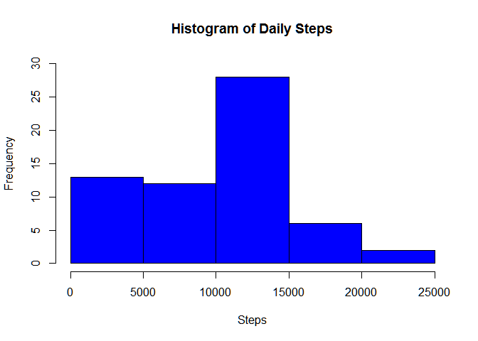
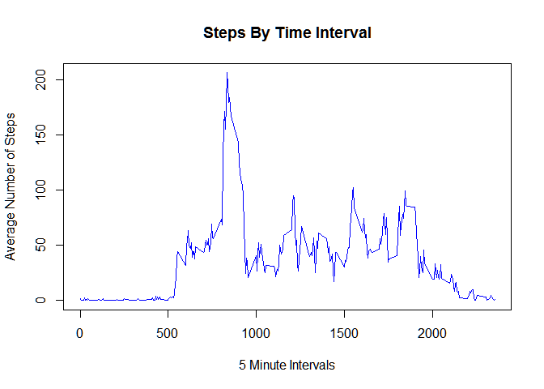
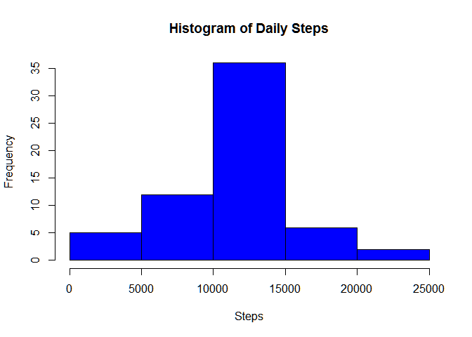
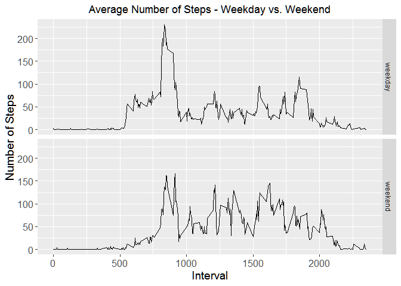

## Loading and preprocessing the data


```r
unzip("activity.zip")
activity <- read.csv("activity.csv", header = TRUE)
activity$date <- as.Date(activity$date)
library(dplyr)
```

```
## Warning: package 'dplyr' was built under R version 4.0.2
```

```
## 
## Attaching package: 'dplyr'
```

```
## The following objects are masked from 'package:stats':
## 
##     filter, lag
```

```
## The following objects are masked from 'package:base':
## 
##     intersect, setdiff, setequal, union
```

```r
library(ggplot2)
```

```
## Warning: package 'ggplot2' was built under R version 4.0.2
```

## What is mean total number of steps taken per day?

### Histogram of the total number of steps taken each day


```r
# Total number of steps taken per day
stepsPerDay <- activity %>% group_by(date) %>%
              summarize(sumsteps = sum(steps, na.rm = TRUE))
```

```
## `summarise()` ungrouping output (override with `.groups` argument)
```

```r
head(stepsPerDay,10)
```

```
## # A tibble: 10 x 2
##    date       sumsteps
##    <date>        <int>
##  1 2012-10-01        0
##  2 2012-10-02      126
##  3 2012-10-03    11352
##  4 2012-10-04    12116
##  5 2012-10-05    13294
##  6 2012-10-06    15420
##  7 2012-10-07    11015
##  8 2012-10-08        0
##  9 2012-10-09    12811
## 10 2012-10-10     9900
```

```r
# Histogram of the total number of steps taken each day
hist(stepsPerDay$sumsteps, main = "Histogram of Daily Steps", 
     col="blue", xlab="Steps", ylim = c(0,30))
```

<!-- -->

### Mean and median number of steps taken each day


```r
mean <- round(mean(stepsPerDay$sumsteps),digits = 2)
median <- round(median(stepsPerDay$sumsteps),digits = 2)
print(paste("The mean is: ", mean))
```

```
## [1] "The mean is:  9354.23"
```

```r
print(paste("The median is: ", median))
```

```
## [1] "The median is:  10395"
```

## What is the average daily activity pattern?

### Time series plot of the average number of steps taken


```r
# A time series plot of the 5-minute interval (x-axis) and the average number of steps taken, averaged across all days (y-axis)
stepsPerInterval <- activity %>% group_by(interval) %>%
                    summarize(meansteps = mean(steps, na.rm = TRUE)) 
```

```
## `summarise()` ungrouping output (override with `.groups` argument)
```

```r
plot(stepsPerInterval$meansteps ~ stepsPerInterval$interval,
     col="blue", type="l", xlab = "5 Minute Intervals", ylab = "Average Number of Steps",
     main = "Steps By Time Interval")
```

<!-- -->

### The 5-minute interval that, on average, contains the maximum number of steps


```r
# A 5-minute interval on average across all the days in the dataset, containing the maximum number of steps
print(paste("Interval containing the most steps on average: ",
            stepsPerInterval$interval[which.max(stepsPerInterval$meansteps)]))
```

```
## [1] "Interval containing the most steps on average:  835"
```

## Imputing missing values


```r
# Total number of missing values in the dataset 
print(paste("The total number of rows with missing value is: ",sum(is.na(activity$steps))))
```

```
## [1] "The total number of rows with missing value is:  2304"
```

```r
# Filling in missing values with median of dataset
activityNA <- activity  
for (i in 1:nrow(activity)){
  if(is.na(activity$steps[i])){
    activityNA$steps[i]<- stepsPerInterval$meansteps[activityNA$interval[i] == stepsPerInterval$interval]
  }
}

# A new dataset that is equal to the original dataset but with the missing data filled in with mean value
stepsPerDay <- activityNA %>% group_by(date) %>%
              summarize(sumsteps = sum(steps, na.rm = TRUE)) 
```

```
## `summarise()` ungrouping output (override with `.groups` argument)
```

```r
      head(stepsPerDay,10)
```

```
## # A tibble: 10 x 2
##    date       sumsteps
##    <date>        <dbl>
##  1 2012-10-01   10766.
##  2 2012-10-02     126 
##  3 2012-10-03   11352 
##  4 2012-10-04   12116 
##  5 2012-10-05   13294 
##  6 2012-10-06   15420 
##  7 2012-10-07   11015 
##  8 2012-10-08   10766.
##  9 2012-10-09   12811 
## 10 2012-10-10    9900
```

```r
# Total number of steps taken per day
hist(stepsPerDay$sumsteps, main = "Histogram of Daily Steps", 
     col="blue", xlab="Steps")
```

<!-- -->

```r
# Mean and median total number of steps taken per day
meanPostNA <- round(mean(stepsPerDay$sumsteps), digits = 2)
medianPostNA <- round(median(stepsPerDay$sumsteps), digits = 2)
print(paste("The mean is: ", mean(meanPostNA)))
```

```
## [1] "The mean is:  10766.19"
```

```r
print(paste("The median is: ", median(medianPostNA)))
```

```
## [1] "The median is:  10766.19"
```

```r
# Comparison of the data
NACompare <- data.frame(mean = c(mean,meanPostNA),median = c(median,medianPostNA))
rownames(NACompare) <- c("Pre NA Transformation", "Post NA Transformation")
print(NACompare)
```

```
##                            mean   median
## Pre NA Transformation   9354.23 10395.00
## Post NA Transformation 10766.19 10766.19
```

## Are there differences in activity patterns between weekdays and weekends?


```r
# Creating new factor variable
activityDoW <- activityNA
activityDoW$date <- as.Date(activityDoW$date)
activityDoW$day <- ifelse(weekdays(activityDoW$date) %in% c("Saturday", "Sunday"), "weekend", "weekday")
activityDoW$day <- as.factor(activityDoW$day)

# A panel plot containing a time series plot of the 5-minute interval (x-axis) and the average number of steps taken, averaged across all weekday days or weekend days (y-axis)
activityWeekday <- filter(activityDoW, activityDoW$day == "weekday")
activityWeekend <- filter(activityDoW, activityDoW$day == "weekend")

activityWeekday <- activityWeekday %>%
  group_by(interval) %>%
  summarize(steps = mean(steps)) 
```

```
## `summarise()` ungrouping output (override with `.groups` argument)
```

```r
activityWeekday$day <- "weekday"

activityWeekend <- activityWeekend %>%
  group_by(interval) %>%
  summarize(steps = mean(steps)) 
```

```
## `summarise()` ungrouping output (override with `.groups` argument)
```

```r
activityWeekend$day <- "weekend"

wkdayWkend <- rbind(activityWeekday, activityWeekend)
wkdayWkend$day <- as.factor(wkdayWkend$day)
head(activityWeekday, 10)
```

```
## # A tibble: 10 x 3
##    interval  steps day    
##       <int>  <dbl> <chr>  
##  1        0 2.25   weekday
##  2        5 0.445  weekday
##  3       10 0.173  weekday
##  4       15 0.198  weekday
##  5       20 0.0990 weekday
##  6       25 1.59   weekday
##  7       30 0.693  weekday
##  8       35 1.14   weekday
##  9       40 0      weekday
## 10       45 1.80   weekday
```

```r
g <- ggplot (wkdayWkend, aes (interval, steps))
g + geom_line() + facet_grid (day~.) + 
  theme(axis.text = element_text(size = 12),axis.title = element_text(size = 14)) + 
  labs(y = "Number of Steps") + labs(x = "Interval") + 
  ggtitle("Average Number of Steps - Weekday vs. Weekend") + 
  theme(plot.title = element_text(hjust = 0.5))
```

<!-- -->
